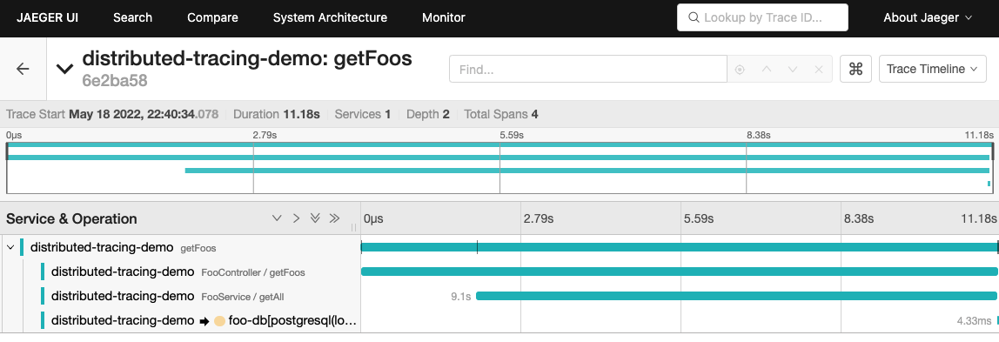

# distributed-tracing-demo
Repository for demostrating how to enable tracing in a Spring Boot microservice.

The /api/foo request executes the following layers:

  @Controller (with a random delay) -> @Service (with a random delay) -> @Repository (with a select all query)

- Configuration via Environment Variables:
  - **DB_HOST**: PostgreSQL host url
  - **DB_PORT**: PostgreSQL port
  - **DB_NAME**: PostgreSQL database for catalog
  - **DB_USER**: PostgreSQL user name
  - **DB_PASS**: PostgreSQL user password

## Run locally

```sh
# Start environment (Postgres and Jaeger)
docker-compose up -d

# Once the everything is running, start application using Maven
mvn spring-boot:run -Dspring-boot.run.jvmArguments="-DDB_HOST=localhost -DDB_PORT=5432 -DDB_NAME=foo-db -DDB_USER=develop -DDB_PASS=develop -Dspring.profiles.active=local"

# Validate
curl localhost:8080/api/foo | jq
# or
curl localhost:8080/actuator/health
```

To review the jaeger traces go to -> http://localhost:16686/ and open 'distributed-tracing-demo' service.

This is an example of an execution:




